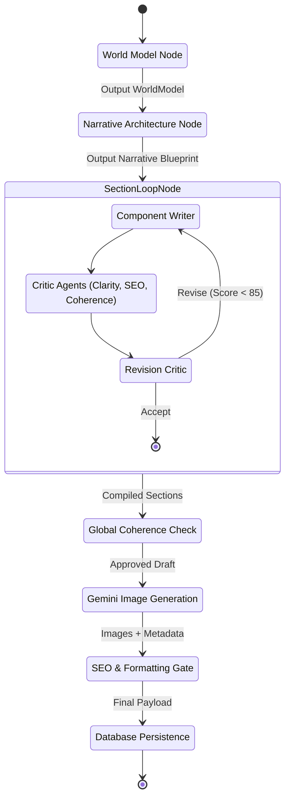
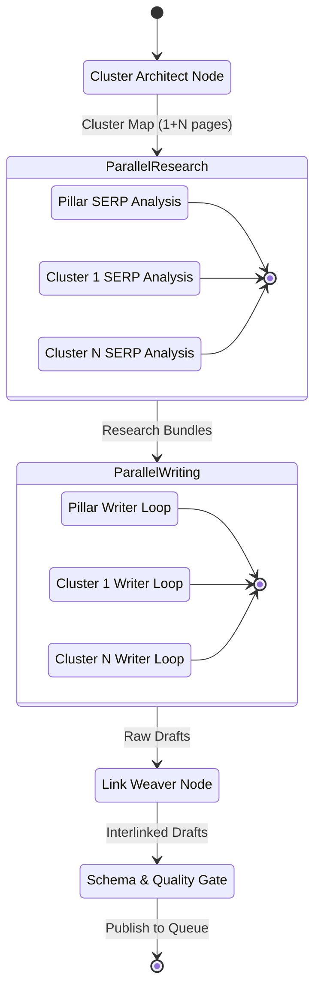
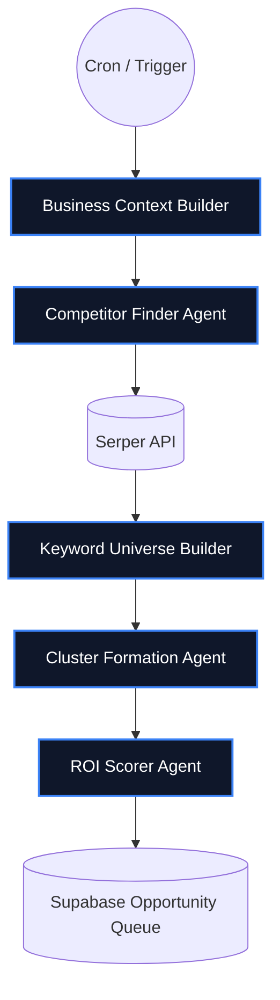

# AI Pipelines & Orchestration

MarketDay’s intelligence layer is powered by multiple specialized agentic workflows orchestrated via LangGraph. Instead of relying on a single monolithic LLM call, the system breaks complex content generation into specialized, autonomous agents that pass state, critique each other's work, and recursively improve output.

Below are the detailed state graphs for the core AI pipelines within the FastAPI microservice.

---

## 1. Single-Article Generation Pipeline

A sophisticated 7-stage state graph designed for on-demand blog generation. It emphasizes narrative structure, fact-checking, and internal coherence through a recursive critic loop.

### Key Innovations:
- **World Model Isolation**: By separating research into its own node, we prevent hallucinations downstream. All writer agents pull facts exclusively from the `world_model` context, not model priors.
- **Recursive Quality Control**: The `SectionLoopNode` runs a mini-graph per section. It utilizes three specialized critic prompts. The `RevisionCritic` makes a hard routing decision, forcing rewrites up to *N* times until quality thresholds are met.

---

## 2. Content Hub Engine (Pillar + Cluster)

The CHE is designed to build entire topic clusters (e.g., 1 Pillar page + 12 Cluster pages) in a single massive parallel execution, injecting topical authority through semantic interlinking.

### Key Innovations:
- **Parallel Execution**: Both Research and Writing stages fan-out to run asynchronously across the cluster, drastically reducing latency.
- **Global Link Weaver**: Rather than asking writers to "guess" internal links, the Link Weaver node holds the entire generated cluster in context and surgically rewrites paragraphs to insert highly semantic, exact-match anchor text linking the pillar and clusters together.

---

## 3. Opportunity Discovery Engine

A scheduled cron-job pipeline that continuously analyzes the market and competitors to fill the content queue with high-ROI topics.

### Agent Responsibilities:
1. **Context Builder**: Synthesizes the tenant's brand guidelines, website copy, and PDFs into a tight vector representation.
2. **Competitor Finder**: Discovers true search competitors (not just product competitors).
3. **Keyword Universe**: Expands seed terms using long-tail permutations.
4. **Cluster Formation**: Groups keywords semantically to avoid cannibalization.
5. **ROI Scorer**: Ranks clusters by search volume vs. domain difficulty, pushing only the most viable options to the tenant's queue.
