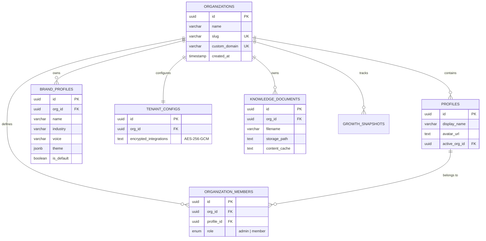
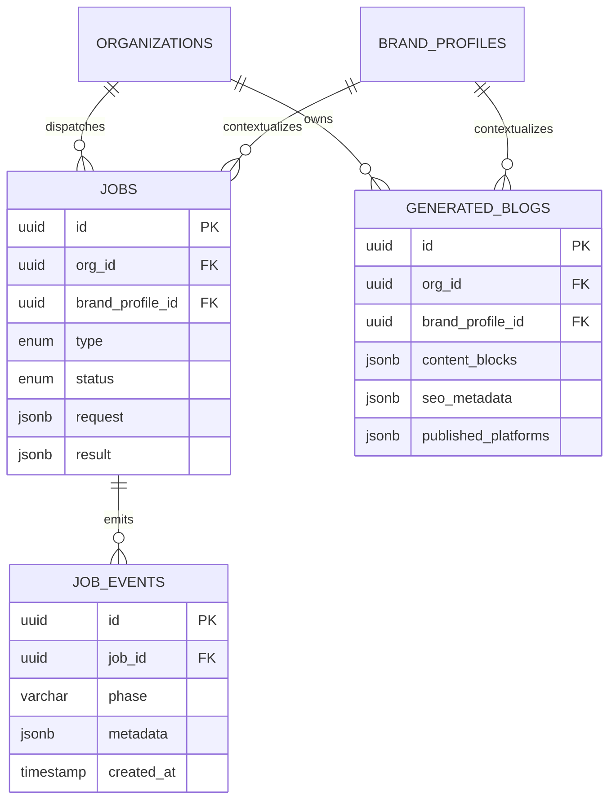
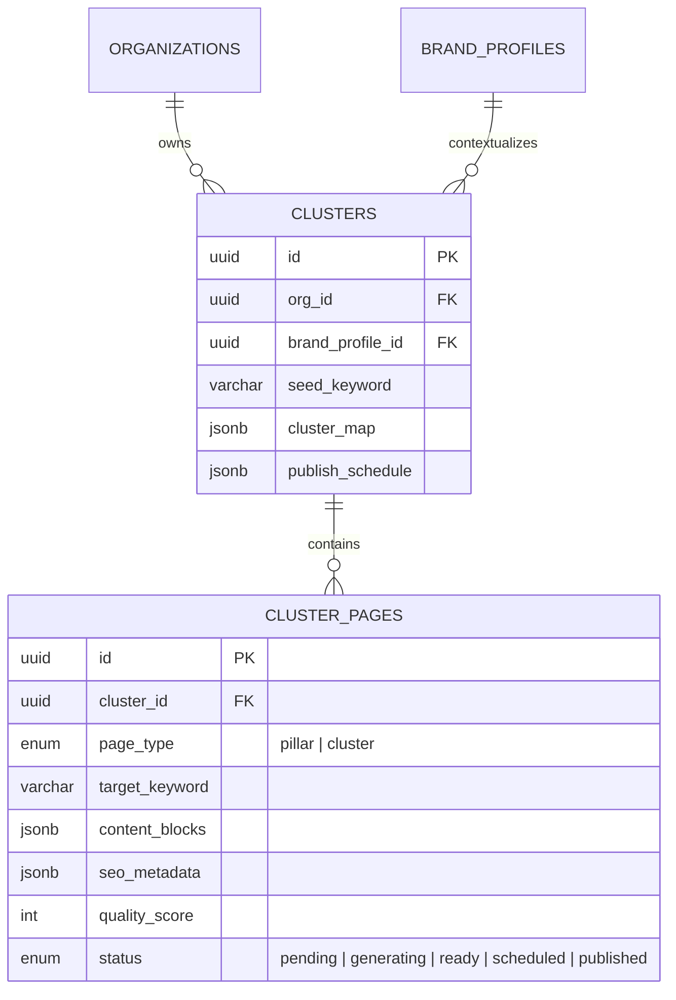
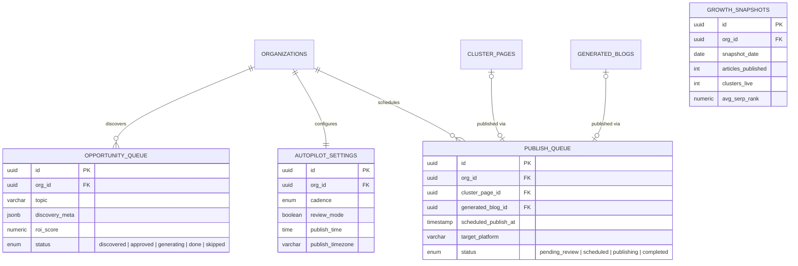

# Database Schema Diagram

## Core Entity Relationships



## Generation & Job Schema



## Content Hub Engine (CHE) Schema



## Autopilot & Publishing Schema



## Core Entity Details

### Organization Entity (Root)
```
organizations
├─ id (PK, UUID, DEFAULT uuid_generate_v4())
├─ name (VARCHAR NOT NULL)
├─ slug (VARCHAR UNIQUE NOT NULL)
├─ custom_domain (VARCHAR UNIQUE)
├─ created_at (TIMESTAMP WITH TIME ZONE)
└─ updated_at (TIMESTAMP WITH TIME ZONE)
```

### Brand Profiles (Configuration)
```
brand_profiles
├─ id (PK, UUID)
├─ org_id (FK → organizations ON DELETE CASCADE)
├─ name (VARCHAR NOT NULL)
├─ industry (VARCHAR)
├─ voice (VARCHAR)
├─ theme (JSONB DEFAULT '{}')
├─ is_default (BOOLEAN DEFAULT false)
└─ created_at (TIMESTAMP)
```

### Clusters (Content Hub Engine)
```
clusters
├─ id (PK, UUID)
├─ org_id (FK → organizations)
├─ brand_profile_id (FK → brand_profiles ON DELETE SET NULL)
├─ seed_keyword (VARCHAR)
├─ cluster_map (JSONB)
└─ publish_schedule (JSONB)

cluster_pages
├─ id (PK, UUID)
├─ cluster_id (FK → clusters ON DELETE CASCADE)
├─ page_type (ENUM: pillar, cluster)
├─ target_keyword (VARCHAR)
├─ content_blocks (JSONB) - typed array of components
├─ seo_metadata (JSONB)
├─ quality_score (INTEGER)
└─ status (ENUM)
```

### Autopilot & Queues
```
opportunity_queue
├─ id (PK, UUID)
├─ org_id (FK → organizations)
├─ topic (VARCHAR)
├─ discovery_meta (JSONB)
├─ roi_score (NUMERIC(5,2))
└─ status (ENUM: discovered, approved, generating, done, skipped)

publish_queue
├─ id (PK, UUID)
├─ org_id (FK → organizations)
├─ cluster_page_id (FK → cluster_pages, nullable)
├─ generated_blog_id (FK → generated_blogs, nullable)
├─ scheduled_publish_at (TIMESTAMP)
├─ target_platform (VARCHAR)
└─ status (ENUM: pending_review, scheduled, publishing, completed, failed)
```

## Relationship Types

- **One-to-Many**: Organization → Brand Profiles, Organization → Clusters, Cluster → Cluster Pages
- **One-to-One**: Organization → Tenant Configs, Organization → Autopilot Settings
- **Polymorphic / Optional FKs**: Publish Queue maps to *either* a `cluster_page_id` *or* a `generated_blog_id`.

## Key Indexes

- `organizations.slug` and `organizations.custom_domain` (UNIQUE, critical for middleware routing)
- `publish_queue.status` + `publish_queue.scheduled_publish_at` (Compound index for the Cron worker polling)
- `opportunity_queue.org_id` + `opportunity_queue.status` + `opportunity_queue.roi_score DESC` (For Autopilot queue pop)
- `jobs.org_id` and `job_events.job_id` (For fast UI event streaming)

## Design Notes

1. **JSONB Content Blocks**: Rather than raw HTML, articles are stored as JSON arrays (`{ type: "heading", text: "..."}`). This structure is extremely robust for updating specific sections without regex, and writing cross-platform adapters (e.g., transforming JSON into WordPress Gutenberg blocks vs Shopify HTML).
2. **Encrypted Integrations**: `tenant_configs.encrypted_integrations` is stored as an AES-256-GCM cipher string. The DB never stores raw CMS API keys or OAuth tokens.
3. **Multi-Tenancy Enforcement**: With the exception of `organizations`, every table includes `org_id` to ensure isolated RLS/service-layer querying.
4. **Append-Only Job Events**: Progress streaming relies on inserting into `job_events` rather than mutating a `jobs.progress` field, providing full history for diagnostics and smooth UX steppers.
