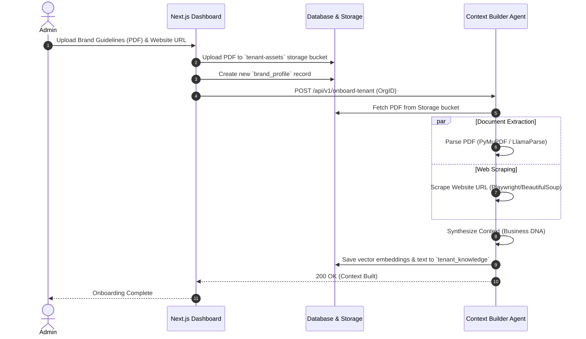
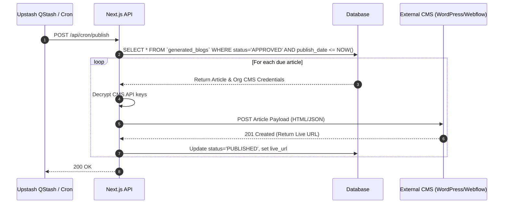

# System Sequence Flows

The MarketDay platform operates on an asynchronous microservice architecture. The Next.js API acts as the client-facing gateway, while the Python FastAPI service orchestrates long-running AI workloads in the background.

Below are the sequence diagrams detailing the exact flow of data across the stack during critical platform operations.

---

## 1. Asynchronous Content Generation Flow

Since content generation (specifically the 7-stage blog pipeline or the Content Hub Engine) can take several minutes to complete, the system uses a webhook-driven asynchronous pattern.

```mermaid
sequenceDiagram
    autonumber
    actor User
    participant NextJS as Next.js API Layer
    participant Supabase as PostgreSQL (Supabase)
    participant FastAPI as AI Microservice
    participant LLM as External APIs (OpenAI/Gemini)

    User->>NextJS: POST /api/generate (Topic, OrgID)
    NextJS->>Supabase: Insert job into `content_jobs` (Status: PENDING)
    Supabase-->>NextJS: Return JobID
    
    NextJS->>FastAPI: POST /api/v1/trigger-generation (JobID, Secret)
    FastAPI-->>NextJS: 202 Accepted
    NextJS-->>User: 202 Accepted (Return JobID)
    
    rect rgb(30, 41, 59)
        Note over FastAPI, LLM: Background LangGraph Execution
        FastAPI->>Supabase: Update job status (Status: PROCESSING)
        
        loop Every LangGraph Node
            FastAPI->>LLM: Request completion / extraction
            LLM-->>FastAPI: Yield structured output
            FastAPI->>Supabase: Update job progress/logs
        end
        
        FastAPI->>Supabase: Insert final article to `generated_blogs`
        FastAPI->>Supabase: Update job status (Status: COMPLETED)
    end
    
    FastAPI->>NextJS: POST /webhook/generation-complete (JobID)
    NextJS->>User: SSE / WebSocket update: Ready for review
```

---

## 2. Multi-Tenant Onboarding & Context Extraction

When a new organization is onboarded, MarketDay immediately begins building its "Business DNA." This context is injected into all future LLM prompts to ensure the AI speaks in the brand's exact voice.

---

## 3. Scheduled CMS Publishing Flow

MarketDay drips content to connected CMS platforms (WordPress, Shopify, Webflow) automatically without user intervention, simulating a natural human publishing cadence.

