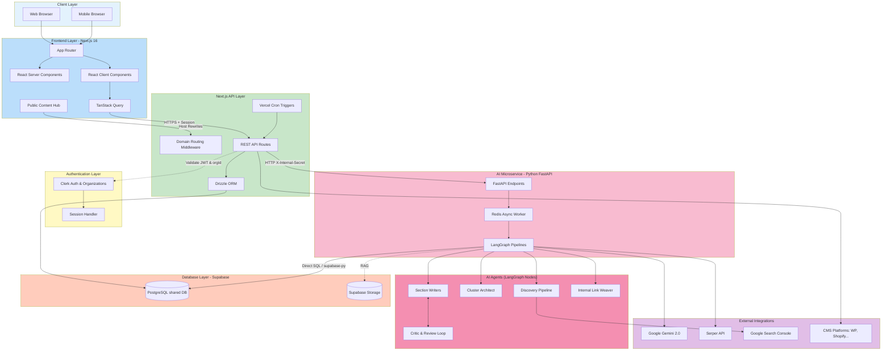
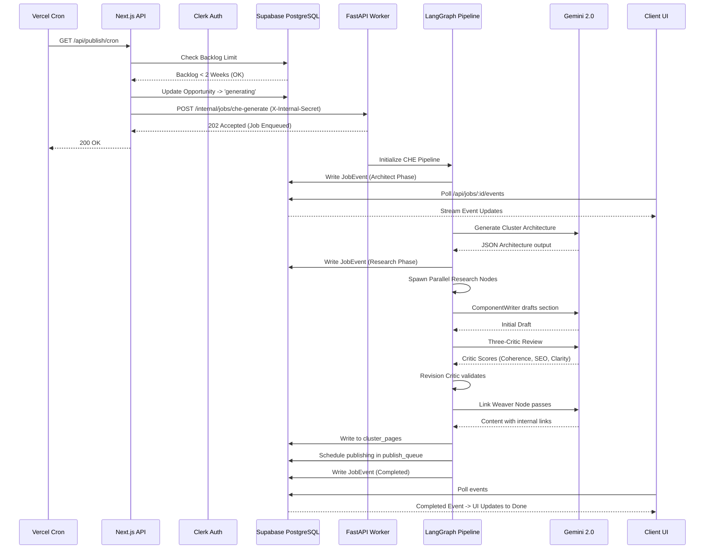
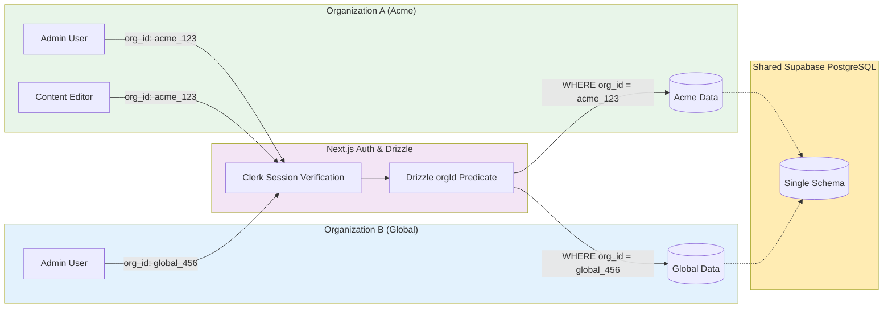
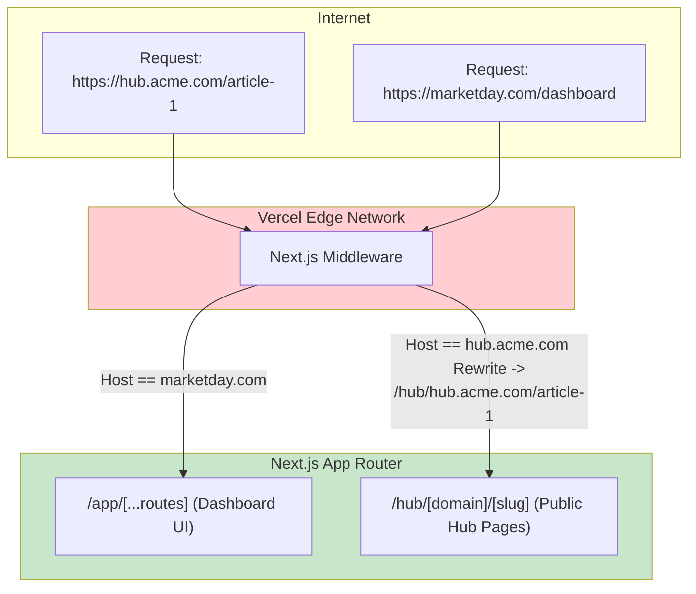
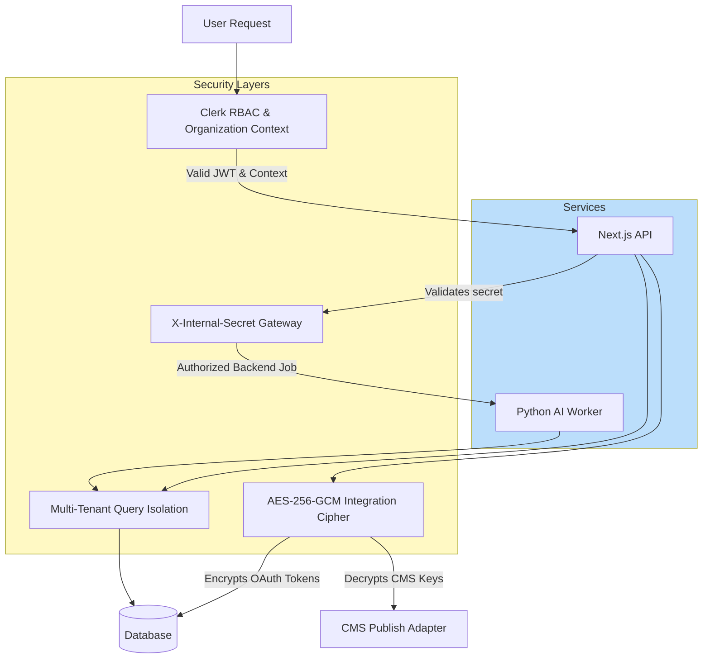

# System Architecture Diagram

## Overview Architecture

## Detailed Request Flow: Content Hub Generation

## Multi-Tenant Architecture

## Custom Domain Routing Architecture

## Security & Integration Architecture

